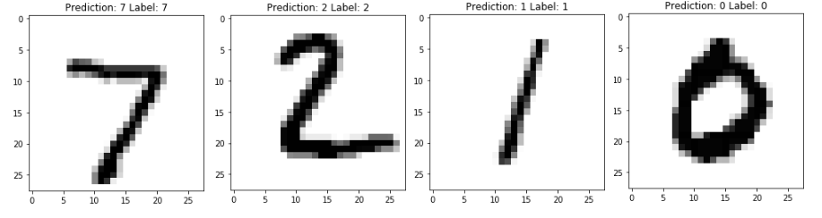
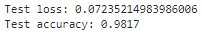

# Machine-Learning-Projects
Repo for aggregating my Machine Learning projects in Keras/Tensorflow. Will be expanded as I continue to produce work.

## Keras ANN Handwriting Recognition Model

  
The first model to be added to my repo. This sequential ANN model built in Keras analyzes human handwriting, specifically
numbers from 0-9 and labels them accordingly with a ~98% accuracy rate.

## Keras CNN Handwriting Recognition Model
  
This model differs from the ANN version in that we analyze the image in the form of 3x3 filters. This approach which allows for receptive fields grants the model the ability to identify features such as edges and curves, which is not possible in a 768-bit bitstream as used in the ANN.

This model is more accurate and capable but substantially slower.
